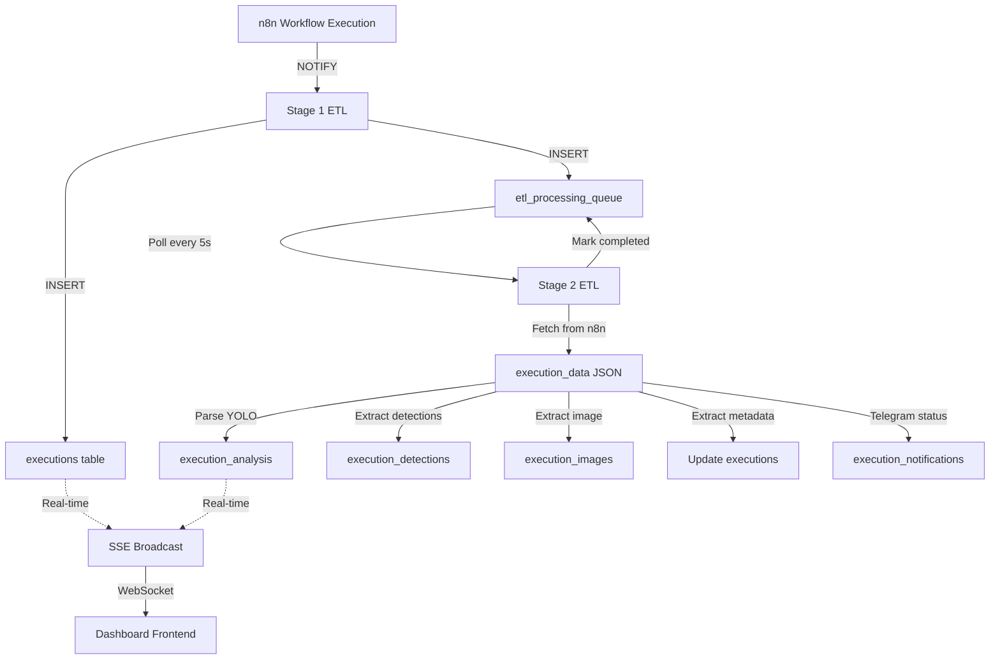

# SAI Dashboard Database Schema

Complete entity-relationship diagram for the `sai_dashboard` PostgreSQL database.

**Last Updated:** October 10, 2025 (05:15 UTC)
**Migration Version:** 004 (Legacy Fields Removed - Pure YOLO Schema)
**Status:** ✅ Migration Complete - All legacy Ollama fields removed from database and code

---

## Entity-Relationship Diagram

```mermaid
erDiagram
    executions ||--o| execution_analysis : "has"
    executions ||--o| execution_images : "has"
    executions ||--o| execution_notifications : "has"
    executions ||--o{ execution_detections : "contains"
    executions ||--o| etl_processing_queue : "queued_for"

    executions {
        bigint id PK "Primary key"
        varchar workflow_id "n8n workflow ID (yDbfhooKemfhMIkC)"
        timestamp execution_timestamp "When execution started"
        timestamp completion_timestamp "When execution finished"
        integer duration_ms "Execution duration in milliseconds"
        varchar status "success, error, waiting"
        varchar mode "webhook, manual, retry"
        bigint retry_of "FK to original execution if retry"
        varchar node_id "Camera node identifier"
        varchar camera_id "Camera identifier"
        varchar device_id "Device identifier (from YOLO)"
        varchar location "Physical location (from metadata)"
        varchar camera_type "rtsp, usb, http"
        timestamp capture_timestamp "When image was captured"
        timestamp created_at
        timestamp updated_at
    }

    execution_analysis {
        bigint execution_id PK_FK "References executions.id"
        uuid request_id "YOLO inference request ID"
        varchar yolo_model_version "YOLO model version (e.g., last.pt)"
        integer detection_count "Number of objects detected"
        boolean has_fire "Fire detected (YOLO)"
        boolean has_smoke "Smoke detected (YOLO)"
        varchar alert_level "none, low, medium, high, critical"
        varchar detection_mode "smoke-only, fire-only, both"
        text_array active_classes "Array of active detection classes"
        jsonb detections "Full detections array from YOLO"
        numeric confidence_fire "Fire confidence (0.0-1.0)"
        numeric confidence_smoke "Smoke confidence (0.0-1.0)"
        numeric confidence_score "Max confidence across all detections"
        integer image_width "Image dimensions from YOLO"
        integer image_height
        numeric yolo_processing_time_ms "YOLO inference time"
        timestamp analysis_timestamp "When analysis completed"
        timestamp updated_at
    }

    execution_detections {
        integer id PK "Auto-increment primary key"
        bigint execution_id FK "References executions.id"
        varchar detection_class "fire, smoke"
        numeric confidence "Detection confidence (0.0-1.0)"
        jsonb bounding_box "Coordinates: x, y, width, height"
        integer detection_index "Index in detections array"
        timestamp created_at
    }

    execution_images {
        bigint execution_id PK_FK "References executions.id"
        varchar original_path "Path to original JPEG (500 chars)"
        varchar thumbnail_path "Path to thumbnail WebP"
        varchar cached_path "Path to cached WebP"
        varchar backup_path "Path to backup location"
        integer size_bytes "Original image size"
        integer width "Image dimensions"
        integer height
        varchar format "jpeg, png, webp"
        numeric quality_score "Image quality metric"
        timestamp extracted_at "When image was extracted"
    }

    execution_notifications {
        bigint execution_id PK "References executions.id (implied FK)"
        boolean telegram_sent "Alert sent to Telegram"
        bigint telegram_message_id "Telegram message ID"
        timestamp telegram_sent_at "When alert was sent"
        timestamp created_at
        timestamp updated_at
    }

    etl_processing_queue {
        bigint id PK "Auto-increment primary key"
        bigint execution_id FK "References executions.id"
        varchar stage "stage2 (future: stage1, stage3)"
        varchar status "pending, processing, completed, failed, skipped"
        integer priority "1-10 (1=highest)"
        integer attempts "Retry counter"
        integer max_attempts "Maximum retries (default: 3)"
        text last_error "Last error message"
        varchar worker_id "ETL worker identifier"
        timestamp queued_at "When added to queue"
        timestamp started_at "When processing started"
        timestamp completed_at "When processing finished"
        integer processing_time_ms "Processing duration"
    }

    dashboard_stats {
        varchar metric_name PK "Metric identifier (50 chars)"
        numeric metric_value "Metric value"
        timestamp last_updated "When metric was updated"
    }
```

---

## Table Descriptions

### **executions** (Core Table)
Primary table containing all workflow execution records from n8n.

**Key Relationships:**
- One-to-one with `execution_analysis`, `execution_images`, `execution_notifications`
- One-to-many with `execution_detections`
- One-to-one with `etl_processing_queue`

**Populated by:** Stage 1 ETL (fast-path insertion via PostgreSQL LISTEN/NOTIFY)

**Indexes:**
- PRIMARY KEY: `id`
- Index on: `workflow_id`, `execution_timestamp`, `status`

---

### **execution_analysis** (YOLO Results)
Complete YOLO fire detection analysis results. **Pure YOLO schema - all legacy Ollama fields removed.**

**Key Fields:**
- **YOLO Detection:** `request_id`, `yolo_model_version`, `detection_count`, `has_fire`, `has_smoke`, `alert_level`, `detection_mode`, `active_classes`, `detections`
- **Confidence Scores:** `confidence_fire`, `confidence_smoke`, `confidence_score`
- **Image Metadata:** `image_width`, `image_height`, `yolo_processing_time_ms`
- **Device Context:** `node_id`, `camera_id`, `camera_location`

**Populated by:** Stage 2 ETL (deep YOLO extraction from n8n execution_data)

**Data Integrity Principle:** ALL fields nullable (NULL = "not available", never use fake defaults)

**Indexes:**
- PRIMARY KEY: `execution_id`
- Indexes on: `alert_level`, `has_fire`, `has_smoke`, `analysis_timestamp`

---

### **execution_detections** (Bounding Boxes)
Individual fire/smoke detections with bounding box coordinates.

**Bounding Box Format (JSONB):**
```json
{
  "x": 100,
  "y": 150,
  "width": 200,
  "height": 180
}
```

**Populated by:** Stage 2 ETL (when `detection_count > 0`)

**Constraints:**
- `detection_class` CHECK: Must be 'fire' or 'smoke'
- `confidence` CHECK: Must be between 0.0 and 1.0

**Indexes:**
- PRIMARY KEY: `id`
- Indexes on: `execution_id`, `detection_class`, `confidence DESC`

---

### **execution_images** (Image Cache)
Image paths and metadata for cached execution images.

**Storage Locations:**
- **Original:** `/mnt/raid1/n8n-backup/images/original/{partition}/{execution_id}.jpg`
- **WebP Cache:** `/mnt/raid1/n8n-backup/images/webp/{partition}/{execution_id}.webp`
- **Thumbnail:** `/mnt/raid1/n8n-backup/images/thumb/{partition}/{execution_id}.webp`

**Partition Strategy:** `partition = floor(execution_id / 1000)`

**Populated by:** Stage 2 ETL (image extraction and processing)

---

### **execution_notifications** (Telegram Alerts)
Telegram notification status for high-priority detections.

**Populated by:** Stage 2 ETL (extracts from n8n Telegram node if present)

---

### **etl_processing_queue** (ETL Pipeline)
Queue for Stage 2 deep processing (YOLO extraction).

**ETL Flow:**
1. Stage 1 ETL inserts execution → Adds to queue with `status='pending'`
2. Stage 2 ETL polls queue → Marks `status='processing'`, sets `started_at`
3. On success → `status='completed'`, sets `completed_at`, `processing_time_ms`
4. On failure → `status='failed'`, increments `attempts`, stores `last_error`
5. Retry logic → Reprocesses if `attempts < max_attempts`

**Worker Coordination:**
- Uses `worker_id` to prevent duplicate processing
- Multiple workers can process queue concurrently
- Queue items locked during processing (optimistic locking)

**Indexes:**
- PRIMARY KEY: `id`
- UNIQUE: `(execution_id, stage)`
- Indexes on: `(status, priority, queued_at)` for pending items, `(status, attempts)` for failed items

---

### **dashboard_stats** (Cached Metrics)
Pre-computed dashboard statistics for performance.

**Example Metrics:**
- `total_executions`
- `total_with_fire_detected`
- `avg_processing_time_ms`
- `cache_hit_rate`

**Usage:** Reduces API query load for dashboard homepage

---

## Data Flow



---

## Migration History

| Version | Date | Description |
|---------|------|-------------|
| 001 | 2025-09-XX | Initial schema with Ollama support |
| 002 | 2025-09-XX | Added ETL queue and two-stage architecture |
| 003 | 2025-10-10 | **YOLO schema redesign** - Replaced Ollama fields with YOLO-specific fields, added `execution_detections` table |
| **004** | **2025-10-10** | **Legacy field removal** - Dropped all backward-compatibility Ollama fields (`risk_level`, `smoke_detected`, `flame_detected`, `alert_priority`, `response_required`, `overall_assessment`, `node_name`, `node_type`, etc.) - Pure YOLO schema achieved |

---

## Key Design Decisions

### 1. **Data Integrity Over Convenience**
- **Principle:** NULL means "not available", never use fake defaults
- **Example:** `alert_level = NULL` (not extracted) vs `alert_level = 'none'` (YOLO said "no detection")

### 2. **Pure YOLO Schema (Migration 004)**
- **Removed:** All legacy Ollama fields (`risk_level`, `smoke_detected`, `flame_detected`, `alert_priority`, `response_required`, etc.)
- **Current:** Pure YOLO fields (`alert_level`, `has_fire`, `has_smoke`, `detection_count`, `detections`)
- **Breaking Change:** Frontend and API updated to use YOLO fields exclusively

### 3. **Two-Stage ETL Architecture**
- **Stage 1:** Fast-path insertion (< 20ms) for real-time dashboard updates
- **Stage 2:** Deep extraction (50-300ms) for complete YOLO analysis
- **Benefit:** Dashboard responsive even during heavy YOLO processing

### 4. **Compact n8n Format Support**
- n8n stores data as reference-based array: `data[4]["YOLO Inference"] = "11"` → `data[11]` → `data[17]` → etc.
- Stage 2 ETL includes recursive resolver for n8n's compact format
- **Critical Fix (Oct 2025):** Updated `extractNodeOutput` to navigate `execution.data.main[0][0].json` structure

### 5. **Partition-Based Image Storage**
- Images partitioned by `floor(execution_id / 1000)` to avoid directory overflow
- Example: execution 186320 → partition 186 → `/images/original/186/186320.jpg`

---

## Performance Characteristics

| Operation | Avg Time | Notes |
|-----------|----------|-------|
| Stage 1 ETL Insert | 10-20ms | Real-time insertion |
| Stage 2 ETL Processing | 50-300ms | Depends on image size |
| API Query (recent 50) | 30-80ms | With all joins |
| Image Cache Lookup | 5-15ms | SSD storage |
| Bounding Box Query | 10-25ms | Indexed on execution_id |

---

## Future Enhancements

- [ ] Add `execution_metadata` table for extensible key-value pairs
- [ ] Implement `execution_events` for audit trail
- [ ] Add `camera_nodes` table for device registry
- [ ] Partition `executions` table by month for long-term scalability
- [ ] Add materialized views for complex dashboard queries

---

**Generated by:** Claude Code
**Database:** PostgreSQL 14+ (Debian 12)
**Application:** SAI Dashboard - Fire Detection Monitoring System
