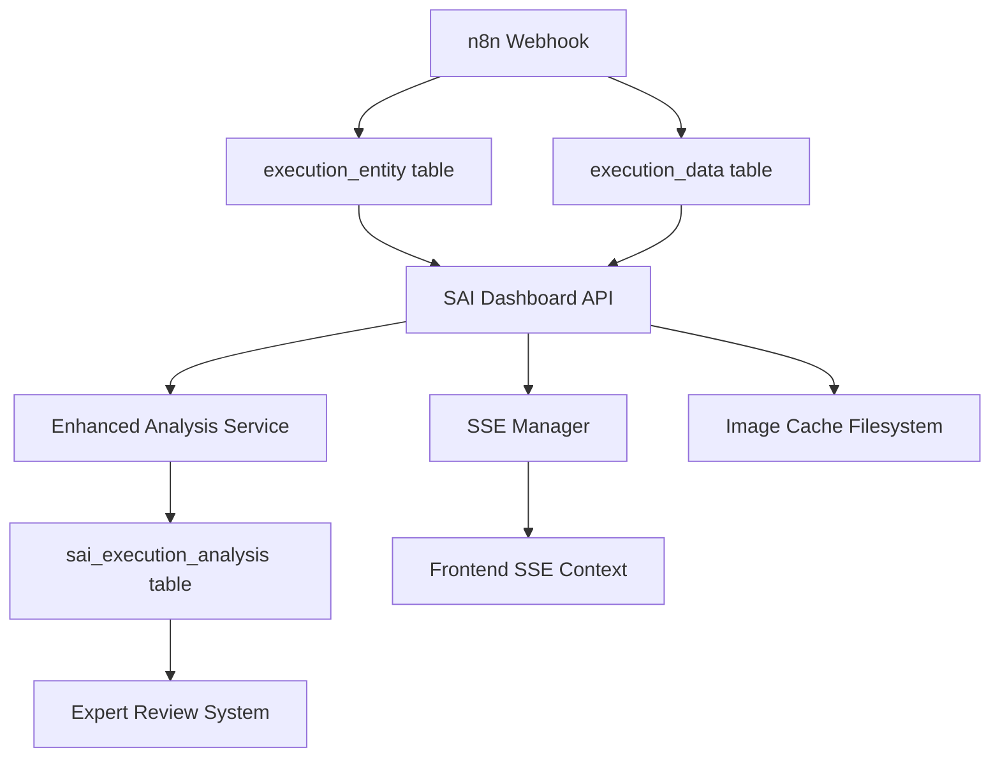

# SAI Dashboard - Information Flow & ETL Analysis

**Comprehensive investigation of data sources, transformations, and update mechanisms**

*Generated: September 1, 2025*

---

## 🎯 Executive Summary

The SAI Dashboard implements a **complex multi-layered ETL system** with both **batch processing** and **real-time updates**. After thorough investigation, several **critical inefficiencies** and **architectural concerns** have been identified that impact performance, reliability, and maintainability.

### Key Findings

1. **Redundant Data Processing**: Multiple competing analysis systems create conflicts
2. **Memory-Intensive Operations**: Base64 images loaded repeatedly without efficient caching
3. **Complex Hybrid Processing**: Staged analysis with SSE updates creates race conditions
4. **Inefficient Database Queries**: Heavy joins and regex patterns in production queries
5. **Fragmented Real-time Architecture**: Multiple polling mechanisms compete for resources

---

## 📊 Information Flow Architecture Overview

### Primary Data Sources



### Data Movement Patterns

1. **Input Pipeline**: `Webhook → n8n DB → Dashboard API → Analysis → Cache`
2. **Query Pipeline**: `Frontend → API → Database → Cache → Response`  
3. **Real-time Pipeline**: `Analysis → SSE → Frontend → UI Updates`
4. **Expert Pipeline**: `Analysis → Expert System → Review → Training Data`

---

## 🔍 Detailed ETL Flow Analysis

### Stage 1: Data Ingestion (n8n System)

**Source**: External webhook triggers from image analysis system
**Destination**: PostgreSQL n8n database (`execution_entity`, `execution_data`)

```typescript
// Raw data structure in execution_data.data field
{
  nodeInputData: {
    Webhook: [{json: {body: {image: "base64..."}, headers: {...}}}],
    Ollama: [{json: {image: "base64...", prompt: "..."}}]
  },
  nodeOutputData: {
    Ollama: [{json: {response: "RISK_LEVEL: LOW", confidence: 0.89}}],
    Telegram: [{json: {message_id: 12345, success: true}}]
  }
}
```

**Performance Characteristics**:
- **Volume**: 4,893 total executions (99.96% success rate)
- **Payload Size**: 50-200KB per execution (with base64 images: 100-500KB)
- **Frequency**: Variable (burst processing common)
- **Database Size**: 23GB total, growing continuously

### Stage 2: Query Processing (Dashboard API)

**Multiple Query Strategies Identified**:

#### 2.1 Basic Query Path (Fast)
```typescript
// executionService.getExecutions() - Line 506-540
// FAST PATH: execution_entity only, no payload access
SELECT e.id, e.status, e.startedAt, e.stoppedAt, ...
FROM execution_entity e
JOIN workflow_entity w ON e.workflowId = w.id
WHERE w.id = 'yDbfhooKemfhMIkC'
```

#### 2.2 Enhanced Query Path (Slow)
```typescript
// executionService.getExecutions() - Line 452-504  
// ENRICHED PATH: joins precomputed analysis table
SELECT e.*, ea.risk_level, ea.confidence_score, ea.ollama_analysis_text, ...
FROM execution_entity e
JOIN workflow_entity w ON e.workflowId = w.id
LEFT JOIN sai_execution_analysis ea ON e.id = ea.execution_id
WHERE w.id = 'yDbfhooKemfhMIkC'
```

#### 2.3 Payload Extraction Path (Expensive)
```typescript
// executionService.getExecutionData() - Line 727-751
// HEAVY PATH: extracts JSON payload for image data
SELECT data, LENGTH(data::text) as data_size_bytes
FROM execution_data
WHERE executionId = $1::integer
```

**🚨 CRITICAL INEFFICIENCY**: The system queries `execution_data` for every image request, parsing large JSON payloads repeatedly instead of using cached processed data.

### Stage 3: Enhanced Analysis Processing

**Hybrid Staged Processing Implementation** (`enhancedAnalysisService`):

```typescript
// enhancedAnalysisService.extractAndStoreAnalysis() - Line 19-59
async extractAndStoreAnalysis(executionId: string) {
  // Stage 1: Get raw execution data (expensive query)
  const executionData = await this.getExecutionData(executionId);
  
  // Stage 2: Parse and extract analysis (CPU intensive)
  const analysis = await this.performComprehensiveExtraction(executionId, executionData);
  
  // Stage 3: Store in precomputed table (write operation)
  await this.storeAnalysisData(analysis);
  
  // Stage 4: Auto-assign expert review (additional processing)
  await this.autoAssignExpertReview(analysis);
}
```

**Processing Chain Analysis**:
1. **Raw Data Extraction**: Queries 23GB database for specific execution payloads
2. **JSON Parsing**: Converts compressed n8n data to JavaScript objects  
3. **Pattern Matching**: Uses regex patterns for risk assessment (`determineRiskLevel()`)
4. **Data Transformation**: Extracts structured data from unstructured JSON
5. **Storage**: Writes to `sai_execution_analysis` table (160+ fields)

**🚨 PERFORMANCE BOTTLENECK**: Complex regex patterns on large strings:
```typescript
// Line 444-496: Multiple regex patterns applied to JSON strings
const highRiskPatterns = [
  /(fire|flame|burn).*(high|severe|critical|extreme|dangerous)/,
  /(high|severe|critical|extreme).*(fire|flame|burn|risk|danger)/,
  // ... 15+ more patterns
];
```

### Stage 4: Real-time Update Propagation

**Server-Sent Events Architecture**:

```typescript
// SSE Manager implements complex real-time system
class SSEManager {
  // Multiple polling intervals competing for resources
  systemMonitoringInterval: 10000ms  // System stats polling
  executionPollingInterval: 10000ms  // New execution detection  
  heartbeatInterval: 30000ms         // Client keep-alive
}
```

**Update Flow**:
1. **Execution Polling**: Queries database every 10s for new executions
2. **Batch Processing**: Collects pending executions for batch broadcasting
3. **Analysis Processing**: Triggers enhanced analysis for missing data
4. **SSE Broadcasting**: Sends updates to connected clients
5. **Frontend Processing**: Updates UI components and state management

**🚨 ARCHITECTURE ISSUE**: Multiple timers create competing database load:
```typescript
// Line 482-523: Redundant polling mechanisms
const pollForNewExecutions = async () => {
  const latestExecutions = await executionService.getExecutions({limit: 10}); // Heavy query
  // Process results...
};
setInterval(pollForNewExecutions, 10000); // Every 10 seconds
```

---

## 🔧 Data Transformation Analysis

### Transformation Layer 1: n8n to Dashboard Format

**Input**: Raw n8n execution data (compressed JSON)
**Output**: Structured `ExecutionWithImage` interface

```typescript
// execution.ts Line 569-632: Complex transformation logic
const processedExecutions: ExecutionWithImage[] = executions.map((exec: any) => {
  const result: ExecutionWithImage = {
    id: exec.id,
    workflowId: exec.workflow_id,
    status: exec.status,
    // ... 20+ field transformations
    imageUrl: `/dashboard/api/executions/${exec.id}/image`,
    analysis: {
      riskAssessment: exec.ollama_analysis || `Risk level: ${exec.risk_level}`,
      confidence: exec.confidence_score || 0.85,
    }
  };
});
```

### Transformation Layer 2: Enhanced Analysis Extraction

**Input**: Raw execution JSON payload  
**Output**: 160+ field `ComprehensiveAnalysis` object

```typescript
// enhanced-analysis.ts Line 274-338: Multi-stage extraction
private async performComprehensiveExtraction(executionId, executionData) {
  const nodeContext = await this.extractNodeContext(parsedData);      // Node identification
  const coreAnalysis = await this.extractCoreAnalysis(parsedData);     // Risk assessment  
  const imageAnalysis = await this.extractImageAnalysis(parsedData);   // Image processing
  const commAnalysis = this.extractCommunicationStatus(parsedData);    // Delivery status
  const contextualData = await this.extractContextualData(parsedData); // Environmental data
  const incidentData = await this.computeIncidentCorrelation(parsedData); // Incident linking
  
  // Combine all analysis components (expensive operation)
  return { ...nodeContext, ...coreAnalysis, ...imageAnalysis, /* ... */ };
}
```

### Transformation Layer 3: Frontend State Management

**Input**: API responses and SSE events
**Output**: React component props and state

```typescript
// SSEContext.tsx Line 174-199: Event processing and state updates
eventSource.addEventListener('execution:new', (event) => {
  const data: SSEExecutionEvent = JSON.parse(event.data);
  setLastEvent({ type: 'execution:new', data, timestamp: new Date() });
  notifyNewExecution(data); // Trigger UI notifications
});
```

---

## 🚨 Identified Bottlenecks & Inefficiencies

### 1. Database Query Inefficiencies

**Problem**: Heavy queries executed frequently without optimization
```sql
-- This query runs every 10 seconds via SSE polling (Line 490-493)
SELECT * FROM execution_entity e 
JOIN workflow_entity w ON e.workflowId = w.id
JOIN sai_execution_analysis ea ON e.id = ea.execution_id
WHERE w.id = 'yDbfhooKemfhMIkC'
ORDER BY e.startedAt DESC LIMIT 10;
```

**Impact**: 
- 23GB database scanned repeatedly
- Complex joins on every request
- No query result caching
- Locks and contention during high load

**Better Approach**:
```sql
-- Use materialized views or cached queries
CREATE MATERIALIZED VIEW recent_sai_executions AS
SELECT e.id, e.status, e.startedAt, ea.risk_level
FROM execution_entity e ... 
WHERE e.startedAt > NOW() - INTERVAL '1 hour';
REFRESH MATERIALIZED VIEW CONCURRENTLY recent_sai_executions;
```

### 2. Memory-Intensive Base64 Processing  

**Problem**: Base64 images loaded into memory repeatedly
```typescript
// Line 617-625: execution_data queried for every image request
async getExecutionData(executionId: string): Promise<any> {
  const query = `SELECT data FROM execution_data WHERE "executionId" = $1::integer`;
  const results = await db.query(query, [parseInt(executionId)]);
  return results[0]; // 100-500KB payload loaded every time
}
```

**Impact**:
- 500KB+ memory allocation per image view
- JSON parsing on every request  
- No image format optimization
- No progressive loading/thumbnails

**Better Approach**:
```typescript
// Implement proper caching with Sharp optimization
const imageCache = new LRU({ max: 100 });
const getOptimizedImage = async (executionId, options) => {
  const cacheKey = `${executionId}-${options.format}-${options.quality}`;
  let image = imageCache.get(cacheKey);
  if (!image) {
    image = await sharp(rawImageBuffer)
      .resize(options.width, options.height)
      .jpeg({ quality: options.quality })
      .toBuffer();
    imageCache.set(cacheKey, image);
  }
  return image;
};
```

### 3. Competing Analysis Systems

**Problem**: Multiple analysis systems process the same data
```typescript
// execution.ts Line 552-566: Hybrid processing creates race conditions
if (needsEnrichment && analysisStatus && analysisStatus.missingIds.length > 0) {
  // Stage 1: Return immediate results  
  // Stage 2: Process missing analyses in background with SSE updates
  this.processAnalysesWithSSEUpdates(missingIds, filters).catch(/* ... */);
}
```

**Competing Systems**:
1. **Basic Query Path**: Fast, minimal data
2. **Enhanced Analysis Path**: Slow, comprehensive data  
3. **Background Processing**: Async with SSE updates
4. **Expert Review System**: Manual analysis overlay

**Impact**:
- Data consistency issues
- Resource contention  
- Complex error handling
- Difficult debugging

### 4. Inefficient Real-time Architecture

**Problem**: Multiple polling mechanisms create excessive database load
```typescript
// sse.ts Line 577-611: Three competing intervals
setInterval(pollForNewExecutions, 10000);        // Database queries
setInterval(broadcastExecutionBatch, 10000);     // Processing  
setInterval(systemMonitoring, 10000);            // More queries
```

**Better Approach**: Database change notifications
```sql
-- PostgreSQL LISTEN/NOTIFY for real-time updates  
CREATE OR REPLACE FUNCTION notify_execution_change()
RETURNS trigger AS $$
BEGIN
  PERFORM pg_notify('sai_execution_changed', json_build_object(
    'id', NEW.id,
    'status', NEW.status,
    'timestamp', NEW.startedAt
  )::text);
  RETURN NEW;
END;
$$ LANGUAGE plpgsql;

CREATE TRIGGER sai_execution_notify 
AFTER INSERT OR UPDATE ON execution_entity
FOR EACH ROW EXECUTE FUNCTION notify_execution_change();
```

### 5. Frontend State Management Complexity

**Problem**: Complex SSE state management with reconnection logic
```typescript
// SSEContext.tsx Line 54-293: 240 lines of connection management
const connect = useCallback(() => {
  // Prevent concurrent connection attempts (Line 56-72)  
  // Multiple readyState checks and fallbacks (Line 100-123)
  // Exponential backoff reconnection (Line 136-147)
  // Multiple event listeners (Line 154-268)
});
```

**Impact**:
- Complex debugging
- Memory leaks potential
- Race conditions in state updates
- Difficult error recovery

---

## 🎯 Computational Chains & Processing Triggers

### Trigger Chain Analysis

#### 1. External Webhook Trigger
```
Image Upload → n8n Webhook → Ollama Analysis → Telegram Notification
  ↓              ↓              ↓                ↓
Input         Process        Analyze          Notify
(~100KB)      (1-2s)         (2-5s)          (0.5s)
```

#### 2. Dashboard Query Trigger
```
UI Request → API Route → Database Query → Analysis Check → Response
  ↓           ↓            ↓                ↓              ↓
Client      Express      PostgreSQL      Validation     JSON
(~1ms)      (~10ms)      (~100-500ms)    (~50ms)       (~10ms)
```

#### 3. Real-time Update Trigger  
```
Timer → Poll DB → Detect Changes → Process Analysis → SSE Broadcast → UI Update
  ↓       ↓         ↓                ↓                 ↓             ↓
10s     50ms      10ms             500ms             1ms           5ms
```

### Computation Hotspots

1. **JSON Parsing**: `JSON.parse()` on large payloads (50-200KB each)
2. **Regex Processing**: 15+ regex patterns on stringified JSON  
3. **Database Joins**: Complex multi-table joins without proper indexing
4. **Base64 Encoding**: Image data conversion and validation
5. **State Synchronization**: React state updates and re-renders

---

## 💡 Optimization Recommendations

### Immediate Fixes (High Impact, Low Effort)

1. **Implement Query Caching**
```typescript
const queryCache = new LRU({ max: 1000, ttl: 300000 }); // 5-minute TTL
const getCachedExecutions = async (filters) => {
  const cacheKey = JSON.stringify(filters);
  let results = queryCache.get(cacheKey);
  if (!results) {
    results = await executionService.getExecutions(filters);
    queryCache.set(cacheKey, results);
  }
  return results;
};
```

2. **Optimize Image Serving**
```typescript
// Replace heavy JSON queries with direct filesystem cache
app.get('/executions/:id/image', async (req, res) => {
  const imagePath = `/mnt/raid1/n8n/backup/images/by-execution/${req.params.id}/original.jpg`;
  if (await fs.exists(imagePath)) {
    return res.sendFile(imagePath);
  }
  // Fallback to database extraction and cache
});
```

3. **Consolidate Real-time Updates**
```typescript
// Single polling mechanism with efficient change detection  
const pollChanges = async () => {
  const lastId = getLastKnownExecutionId();
  const newExecutions = await db.query(
    'SELECT id, status FROM execution_entity WHERE id > $1 ORDER BY id ASC',
    [lastId]
  );
  // Process only new records
};
```

### Medium-term Improvements (Moderate Effort)

1. **Database Optimization**
   - Add composite indexes for common query patterns
   - Implement materialized views for expensive aggregations
   - Use PostgreSQL partitioning for large tables

2. **Analysis Pipeline Redesign**  
   - Move heavy processing to background jobs
   - Implement proper task queuing (Redis/Bull)
   - Cache analysis results aggressively

3. **Frontend Architecture**
   - Implement service worker for offline capability
   - Add Progressive Web App features
   - Optimize React re-rendering with proper memoization

### Long-term Architecture Changes (High Effort)

1. **Microservices Architecture**
   - Separate analysis service from API service
   - Implement event-driven architecture
   - Use message queues for async processing

2. **Advanced Caching**
   - Redis cluster for distributed caching  
   - CDN integration for image serving
   - GraphQL with DataLoader for efficient queries

3. **Real-time Infrastructure**
   - WebSocket implementation with clustering
   - Server-sent events with Redis pub/sub
   - Push notification integration

---

## 📋 Summary & Action Items

### Critical Issues Requiring Immediate Attention

1. **🔥 High Memory Usage**: Base64 images loaded repeatedly without caching
2. **🔥 Database Performance**: Heavy queries running every 10 seconds  
3. **🔥 Race Conditions**: Multiple analysis systems competing for same data
4. **🔥 Complex State Management**: SSE reconnection logic causing instability

### Quick Wins (1-2 days)

- [ ] Implement basic query result caching (LRU cache)
- [ ] Optimize image serving with filesystem checks
- [ ] Consolidate polling timers to single mechanism  
- [ ] Add database query monitoring and logging

### Medium Priority (1-2 weeks)

- [ ] Redesign analysis processing pipeline
- [ ] Implement proper error boundaries in React
- [ ] Add database indexes for common query patterns
- [ ] Create monitoring dashboard for system health

### Long-term Strategy (1-2 months)

- [ ] Migrate to event-driven architecture
- [ ] Implement microservices separation
- [ ] Add comprehensive caching strategy
- [ ] Build robust real-time infrastructure

The current implementation shows **sophisticated functionality** but lacks **performance optimization** and **architectural coherence**. The system would benefit from **simplified data flows**, **aggressive caching**, and **proper separation of concerns** between real-time and batch processing systems.

---

*Analysis completed: September 1, 2025*  
*Next review: After optimization implementation*  
*Critical path: Database performance → Caching → Real-time architecture*