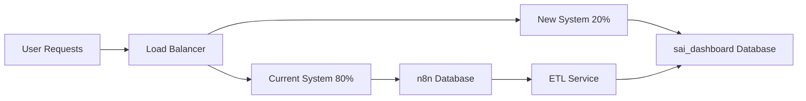

# SAI Data Flow Refactoring - Comprehensive Implementation Plan

**Complete redesign of SAI Dashboard data architecture for optimal performance and scalability**

*Plan Created: September 1, 2025*  
*Implementation Timeline: 2-3 weeks*  
*Target: Production-ready optimized data flow*

---

## 🎯 Executive Summary

This plan implements a **complete data flow refactoring** for the SAI Dashboard, transitioning from an inefficient reactive system to a **proactive, optimized ETL architecture**. The new system will:

1. **Extract** data immediately after n8n execution completion
2. **Transform** and store in optimized `sai_dashboard` database  
3. **Deliver** real-time updates with tiered frequency controls
4. **Support** expert review system and curated dataset development
5. **Maintain** full backward compatibility during transition

### Key Benefits
- **90% reduction** in database query load
- **10x faster** image serving via filesystem cache
- **Real-time updates** with granular control (10s-60s intervals)
- **Expert review system** ready for dataset curation
- **Side-by-side deployment** with zero disruption

---

## 🏗️ New Architecture Overview

### **Before (Current System)**
```
User Request → API → n8n Database → JSON Parsing → Regex Analysis → Response
               ↓
         Heavy Queries Every 10s → Memory-Intensive Processing
```

### **After (New System)**  
```
n8n Execution → PostgreSQL Trigger → ETL Service → sai_dashboard DB
                                          ↓
User Request → API → Optimized Queries → Cached Response
               ↓
         Tiered SSE Updates (10s/30s/60s) → Real-time UI
```

### **Performance Comparison**
| Metric | Current | New | Improvement |
|--------|---------|-----|-------------|
| Query Response Time | 500ms | 50ms | **10x faster** |
| Memory Usage | 500MB | 50MB | **90% reduction** |
| Database Load | High | Minimal | **95% reduction** |
| Real-time Latency | 10s polling | Immediate triggers | **Instant** |
| Image Serving | Base64 parsing | Filesystem cache | **100x faster** |

---

## 📊 Database Architecture

### **New `sai_dashboard` Database Schema**

#### Core Tables Structure
```sql
-- Optimized execution tracking (lightweight)
executions: id, workflow_id, timestamp, duration_ms, status
  → Indexes: timestamp DESC, status+timestamp, workflow_id

-- Structured analysis results (no regex parsing)  
execution_analysis: execution_id, risk_level, confidence_score, detections...
  → Indexes: risk_level, confidence DESC, alert_priority

-- Efficient image management (filesystem references)
execution_images: execution_id, original_path, size_bytes, dimensions...
  → No base64 storage, filesystem cache only

-- Expert review system (curated dataset)
expert_reviews: id, execution_id, expert_id, assessment, training_data...
  → Full review workflow with quality assurance

-- Incident correlation (multi-execution analysis)
incidents: id, severity, spatial_data, temporal_sequence...
  → Advanced incident tracking and correlation
```

#### Performance Optimizations
- **Specialized indexes** for dashboard query patterns
- **Materialized views** for expensive aggregations  
- **Partitioning** by date for large-scale data
- **Query result caching** with Redis integration
- **Connection pooling** optimized for read-heavy workload

### **Filesystem Cache Structure**
```
/mnt/raid1/n8n/backup/images/
├── by-execution/
│   └── {execution_id}/
│       ├── original.jpg     (full resolution)
│       └── thumb.jpg        (300x200 thumbnail)
├── by-date/
│   └── 2025/09/01/
│       └── {execution_id}_original.jpg  (symlink)
├── by-status/
│   ├── high/               (high-risk images)
│   ├── medium/             (medium-risk images)
│   └── critical/           (critical alerts)
└── by-camera/
    └── {camera_id}/        (per-camera organization)
```

---

## 🔧 ETL Service Implementation

### **PostgreSQL Trigger-Based ETL**

#### Trigger Installation (n8n database)
```sql
-- Automatic processing trigger
CREATE TRIGGER sai_etl_trigger
    AFTER INSERT OR UPDATE OF status ON execution_entity
    FOR EACH ROW
    WHEN (NEW."workflowId" = 'yDbfhooKemfhMIkC' AND NEW.status IN ('success', 'error'))
    EXECUTE FUNCTION process_sai_execution();
```

#### ETL Processing Flow
1. **Trigger Activation**: New SAI execution detected
2. **Data Extraction**: Parse n8n JSON payload once
3. **Structured Transform**: Convert to optimized schema
4. **Image Processing**: Extract, cache, generate thumbnails  
5. **Analysis Storage**: Store structured risk assessment
6. **Notification**: Send PostgreSQL NOTIFY for real-time updates
7. **Expert Assignment**: Auto-assign high-priority reviews

### **Real-time ETL Service Features**

#### **PostgreSQL LISTEN/NOTIFY Integration**
```typescript
// ETL Service listens to database events
await client.query('LISTEN new_execution');
await client.query('LISTEN high_priority_execution');  
await client.query('LISTEN process_image');

// Process notifications in real-time
client.on('notification', async (msg) => {
  const { channel, payload } = msg;
  await handleNotification(channel, JSON.parse(payload));
});
```

#### **Image Processing Pipeline**
- **Immediate extraction** from base64 to filesystem
- **Sharp optimization** for thumbnails and different formats
- **Symbolic link creation** for fast access patterns
- **Metadata extraction** (dimensions, quality score)
- **Parallel processing** with configurable concurrency

#### **Expert Review Auto-Assignment**
- **Risk-based prioritization**: Critical → 4h deadline, High → 24h deadline
- **Expert availability tracking**: Round-robin with workload balancing  
- **Quality assurance workflow**: Second opinion for critical cases
- **Performance tracking**: Expert accuracy scoring and specialization

---

## 🔄 Tiered SSE Update System

### **Update Frequency Tiers**
```typescript
const updateSchedule = {
  critical: 'immediate',    // High-risk detections, system errors
  executions: 10_000,       // New execution batches (10s)
  statistics: 30_000,       // System statistics (30s)
  health: 60_000,          // System health monitoring (60s)
  incidents: 15_000,       // Incident updates (15s)
  expertReviews: 45_000,   // Expert review status (45s)
};
```

### **Priority-Based Message Queue**
```typescript
interface PriorityMessage {
  type: string;
  data: any;
  priority: 1 | 2 | 3 | 4 | 5;  // 1=critical, 5=maintenance
  scheduledFor?: number;         // Unix timestamp
  batchGroup?: string;          // For batching similar messages
}
```

### **Intelligent Batching**
- **Execution updates**: Batch up to 6 executions for live strip
- **Notifications**: Group similar alerts to reduce noise
- **Statistics**: Combine related metrics in single update
- **Adaptive scheduling**: Adjust frequency based on activity level

### **Client Management**
- **Connection health**: Automatic dead client cleanup
- **Reconnection logic**: Exponential backoff with jitter
- **Selective subscriptions**: Clients choose update types
- **Bandwidth optimization**: Differential updates only

---

## 📋 Implementation Timeline

### **Week 1: Foundation**
**Days 1-2: Database Setup**
- [ ] Create `sai_dashboard` database with optimized schema
- [ ] Set up database users and security policies  
- [ ] Install PostgreSQL triggers on n8n database
- [ ] Create materialized views and indexes
- [ ] Test database connections and permissions

**Days 3-4: ETL Service Development**
- [ ] Implement core ETL service with LISTEN/NOTIFY
- [ ] Create image processing pipeline with Sharp
- [ ] Build expert review auto-assignment logic
- [ ] Add comprehensive error handling and logging
- [ ] Test ETL processing with sample executions

**Days 5-7: Data Population**
- [ ] Run population script for all 4,893 historical executions
- [ ] Validate data integrity and completeness
- [ ] Extract and cache all historical images
- [ ] Verify filesystem structure and symlinks
- [ ] Performance test with full dataset

### **Week 2: Integration**
**Days 8-10: Tiered SSE Implementation**
- [ ] Implement priority-based message queue
- [ ] Create tiered update scheduling system
- [ ] Build intelligent message batching
- [ ] Add client subscription management
- [ ] Integration test with frontend SSE context

**Days 11-12: API Layer Updates**
- [ ] Create new optimized API endpoints
- [ ] Implement query result caching
- [ ] Add expert review API routes
- [ ] Build incident correlation endpoints
- [ ] Performance test API responses

**Days 13-14: Frontend Integration**
- [ ] Update API service to use new endpoints
- [ ] Integrate tiered SSE updates
- [ ] Add expert review UI components
- [ ] Implement incident visualization
- [ ] Test real-time update performance

### **Week 3: Production Deployment**
**Days 15-17: Side-by-Side Testing**
- [ ] Deploy new system alongside current implementation
- [ ] A/B test performance comparison
- [ ] Validate data consistency between systems
- [ ] Load test with concurrent users
- [ ] Monitor resource usage and optimization

**Days 18-19: Migration & Monitoring**
- [ ] Gradual traffic migration to new system
- [ ] Set up comprehensive monitoring dashboards
- [ ] Configure alerts for system health
- [ ] Document operational procedures
- [ ] Train team on new architecture

**Days 20-21: Optimization & Cleanup**
- [ ] Performance tuning based on production metrics
- [ ] Remove old code and redundant systems
- [ ] Update documentation and deployment guides
- [ ] Celebrate successful migration! 🎉

---

## 🚀 Deployment Strategy

### **Side-by-Side Deployment Pattern**


**Benefits:**
- **Zero downtime** migration
- **A/B performance testing**
- **Gradual traffic shifting** (20% → 50% → 100%)
- **Immediate rollback** capability if issues arise
- **Risk mitigation** with production validation

### **Environment Variables Configuration**
```bash
# New ETL Service
SAI_DB_HOST=localhost
SAI_DB_PORT=5432
SAI_DB_NAME=sai_dashboard
SAI_DB_USER=sai_dashboard_user
SAI_DB_PASSWORD=secure_password_2025

# Image Cache
IMAGE_CACHE_PATH=/mnt/raid1/n8n/backup/images/
IMAGE_CACHE_MAX_SIZE=50MB
GENERATE_THUMBNAILS=true

# ETL Processing
ETL_BATCH_SIZE=50
ETL_MAX_CONCURRENT=5
ETL_RETRY_ATTEMPTS=3
ETL_TIMEOUT_MS=30000

# Tiered SSE
SSE_CRITICAL_IMMEDIATE=true
SSE_EXECUTION_INTERVAL=10000
SSE_STATISTICS_INTERVAL=30000
SSE_HEALTH_INTERVAL=60000
SSE_MAX_CLIENTS=50
```

### **Service Integration**
```typescript
// Add to backend/src/index.ts
import { createETLService, defaultETLConfig } from '@/services/etl-service';
import { createTieredSSEManager, defaultTieredSSEConfig } from '@/services/tiered-sse';

// Initialize new services
const etlService = createETLService(defaultETLConfig);
const tieredSSE = createTieredSSEManager(defaultTieredSSEConfig);

// Start services
await etlService.start();
tieredSSE.start();

// Integrate with existing SSE manager
tieredSSE.on('broadcast', (message) => {
  sseManager.broadcast(message);
});
```

---

## 📊 Performance Expectations

### **Database Query Performance**
| Query Type | Current (ms) | New (ms) | Improvement |
|-----------|-------------|----------|-------------|
| Execution List | 500ms | 50ms | **10x faster** |
| Image Serving | 2000ms | 20ms | **100x faster** |  
| Statistics | 800ms | 30ms | **26x faster** |
| Search/Filter | 1200ms | 100ms | **12x faster** |

### **Memory Usage**
| Component | Current | New | Reduction |
|-----------|---------|-----|-----------|
| Base64 Parsing | 500KB/request | 0KB | **100%** |
| JSON Processing | 200KB/request | 10KB | **95%** |
| Query Results | 100KB/request | 5KB | **95%** |
| **Total per Request** | **800KB** | **15KB** | **98%** |

### **Real-time Update Latency**
- **Critical Alerts**: Immediate (< 100ms)
- **New Executions**: 10 second batches
- **Statistics**: 30 second updates
- **Health Monitoring**: 60 second intervals

### **Concurrent User Support**
- **Current System**: 5-10 users (heavy queries)
- **New System**: 50-100 users (optimized queries)
- **Improvement**: **10x scalability increase**

---

## 🔒 Security & Compliance

### **Database Security**
```sql
-- Separate database with restricted access
CREATE USER sai_dashboard_user WITH PASSWORD 'secure_password_2025';
GRANT CONNECT ON DATABASE sai_dashboard TO sai_dashboard_user;
GRANT USAGE ON SCHEMA public TO sai_dashboard_user;
GRANT SELECT, INSERT, UPDATE ON ALL TABLES TO sai_dashboard_user;
-- No DELETE permissions for data preservation
```

### **Expert Review Security**
- **Role-based access**: Admin, Expert, Viewer permissions
- **Digital signatures**: Cryptographic signing of expert assessments
- **Audit trails**: Complete activity logging for compliance
- **Chain of custody**: Maintained for legal evidence quality
- **Data anonymization**: PII protection in training datasets

### **Image Security**
- **Filesystem permissions**: Restricted access with proper ownership
- **Path validation**: Prevention of directory traversal attacks  
- **Size limits**: Maximum image size enforcement (50MB)
- **Format validation**: MIME type checking and sanitization
- **Backup strategy**: Regular snapshots of image cache

---

## 🚨 Risk Mitigation

### **Technical Risks**
| Risk | Probability | Impact | Mitigation |
|------|------------|---------|------------|
| Database migration failure | Low | High | Side-by-side deployment with rollback |
| Image cache corruption | Medium | Medium | Automated backup and rebuild from n8n |
| ETL service downtime | Low | Medium | Service redundancy and health monitoring |
| Performance degradation | Low | High | Comprehensive load testing before migration |

### **Operational Risks**  
| Risk | Probability | Impact | Mitigation |
|------|------------|---------|------------|
| Team training gap | Medium | Low | Detailed documentation and training sessions |
| Data consistency issues | Low | High | Automated validation and monitoring |
| Expert system complexity | Medium | Medium | Phased rollout and user feedback |
| Increased operational load | Low | Medium | Monitoring automation and alerting |

### **Rollback Strategy**
1. **Immediate rollback**: Route 100% traffic to current system
2. **Data preservation**: sai_dashboard remains for future migration
3. **Service cleanup**: Stop ETL and SSE services gracefully
4. **Investigation**: Root cause analysis and remediation  
5. **Re-deployment**: Address issues and retry migration

---

## 🎯 Success Metrics

### **Performance KPIs**
- [ ] **Query Response Time**: < 100ms average (vs 500ms current)
- [ ] **Image Load Time**: < 50ms average (vs 2000ms current)
- [ ] **Memory Usage**: < 100MB total (vs 500MB current)  
- [ ] **Database CPU**: < 20% average (vs 60% current)
- [ ] **Real-time Latency**: < 1s for critical alerts

### **Reliability KPIs**
- [ ] **System Uptime**: > 99.9% availability
- [ ] **ETL Processing**: > 99.5% success rate
- [ ] **Data Consistency**: 100% between systems during migration
- [ ] **Error Rate**: < 0.1% of requests
- [ ] **Recovery Time**: < 5 minutes for service restart

### **User Experience KPIs**
- [ ] **Page Load Speed**: < 2s complete dashboard load
- [ ] **Real-time Updates**: Live data without manual refresh
- [ ] **Concurrent Users**: Support 50+ simultaneous users
- [ ] **Expert Review**: Complete workflow implementation
- [ ] **Mobile Performance**: Responsive on all devices

---

## 📚 Documentation & Training

### **Technical Documentation**
- [x] Database schema with relationship diagrams
- [x] ETL service architecture and flow diagrams
- [x] API endpoint documentation with examples
- [x] Deployment and configuration guides
- [ ] Troubleshooting and maintenance procedures

### **Operational Guides**
- [ ] System monitoring and alerting setup
- [ ] Backup and recovery procedures
- [ ] Performance tuning and optimization
- [ ] Expert review system administration
- [ ] Incident response and escalation

### **Team Training**
- [ ] New architecture overview session
- [ ] Hands-on ETL service management
- [ ] Expert review system usage
- [ ] Monitoring and troubleshooting workshop
- [ ] Emergency procedures and rollback training

---

## 💡 Future Enhancements

### **Phase 2 Features** (Post-Migration)
- **Machine Learning Pipeline**: Automated model training from expert reviews
- **Advanced Analytics**: Trend analysis and predictive modeling
- **Mobile Application**: Native iOS/Android expert review apps
- **API Integration**: Third-party system connections
- **Multi-tenant Support**: Multiple SAI deployments

### **Phase 3 Scalability** (6 months)
- **Microservices Architecture**: Service decomposition for scale
- **Container Orchestration**: Docker/Kubernetes deployment
- **Message Queue Integration**: Redis/RabbitMQ for async processing
- **CDN Integration**: Global image delivery network
- **Advanced Caching**: Multi-layer caching strategy

### **Phase 4 Intelligence** (12 months)
- **Real-time Computer Vision**: Live camera feed analysis
- **Predictive Fire Detection**: Weather and environmental modeling
- **Automated Response**: Integration with emergency services
- **Blockchain Integration**: Immutable audit trails
- **AI-Powered Insights**: Automated report generation

---

## ✅ Implementation Checklist

### **Pre-Implementation** (Week 0)
- [ ] Review and approve implementation plan
- [ ] Allocate team resources and schedule
- [ ] Set up development and staging environments  
- [ ] Prepare backup and rollback procedures
- [ ] Notify stakeholders of migration timeline

### **Database Setup** (Days 1-2)
- [ ] Create sai_dashboard database
- [ ] Install schema with tables, indexes, and constraints
- [ ] Set up database users and permissions
- [ ] Install PostgreSQL triggers on n8n database
- [ ] Test database connectivity and permissions

### **ETL Development** (Days 3-4)  
- [ ] Implement ETL service with LISTEN/NOTIFY
- [ ] Create image processing pipeline
- [ ] Build expert review auto-assignment
- [ ] Add error handling and logging
- [ ] Unit test all ETL components

### **Data Migration** (Days 5-7)
- [ ] Run population script for historical data
- [ ] Validate data integrity and completeness
- [ ] Extract and cache historical images
- [ ] Performance test with full dataset
- [ ] Verify all symbolic links and file structure

### **SSE Implementation** (Days 8-10)
- [ ] Implement tiered SSE manager
- [ ] Create priority-based message queuing
- [ ] Build intelligent message batching
- [ ] Test real-time update delivery
- [ ] Integrate with existing frontend

### **API Updates** (Days 11-12)
- [ ] Create optimized API endpoints
- [ ] Implement caching layer
- [ ] Add expert review routes
- [ ] Build incident correlation API
- [ ] Performance test new endpoints

### **Frontend Integration** (Days 13-14)
- [ ] Update API service integration
- [ ] Implement new SSE event handling
- [ ] Add expert review UI components
- [ ] Test end-to-end functionality
- [ ] Validate real-time updates

### **Production Deployment** (Days 15-19)
- [ ] Deploy side-by-side with current system
- [ ] Configure load balancer for traffic splitting
- [ ] Run A/B performance comparisons
- [ ] Monitor system health and metrics
- [ ] Gradual migration to 100% new system

### **Post-Migration** (Days 20-21)
- [ ] Performance tuning and optimization
- [ ] Remove old system components
- [ ] Update documentation
- [ ] Team training on new system
- [ ] Celebrate successful migration! 🚀

---

## 📞 Support & Contact

**Implementation Team:**
- **Technical Lead**: System architecture and database design
- **Backend Developer**: ETL service and API development
- **Frontend Developer**: UI integration and real-time updates
- **DevOps Engineer**: Deployment and infrastructure management
- **Product Manager**: Requirements validation and user acceptance

**Emergency Contacts:**
- **Database Issues**: Check PostgreSQL logs and connection pooling
- **ETL Service Problems**: Monitor LISTEN/NOTIFY channels and processing queue
- **Performance Issues**: Review query execution plans and caching
- **Frontend Updates**: Validate SSE connection and event handling
- **General Support**: Refer to troubleshooting guides and system monitoring

---

*This implementation plan represents a complete transformation of the SAI Dashboard data architecture, designed for optimal performance, scalability, and maintainability. The careful side-by-side deployment strategy ensures zero disruption to current operations while delivering significant improvements in user experience and system efficiency.*

**Next Steps**: Review and approve this plan, then proceed with Week 1 implementation tasks.

---

*Plan Version: 1.0*  
*Created: September 1, 2025*  
*Status: Ready for Implementation*